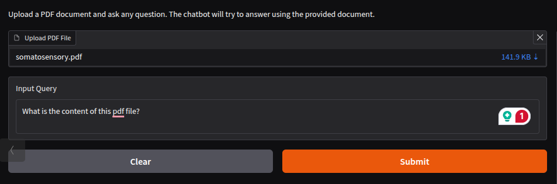
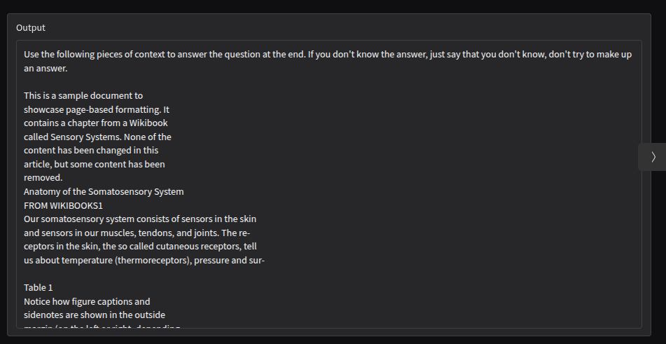

# Simple PDF QA Chatbot

This is just a simple QA Chatbot made with LangChain, HuggingFace and Gradio.

LLm model name: `"EleutherAI/gpt-neo-1.3B"`.

Embedding model name: `"sentence-transformers/all-MiniLM-L6-v2"`.

## Set up

```bash
# Create a virtual environment inside the project folder
python venv my_env

# Activate my_env
source my_env/bin/activate

# Install dependence libraries
pip install -r requirements.txt
```

```bash
# Run application
python qa_chatbot.py
```

## Demo


